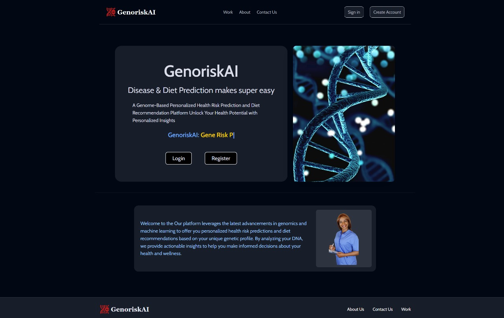
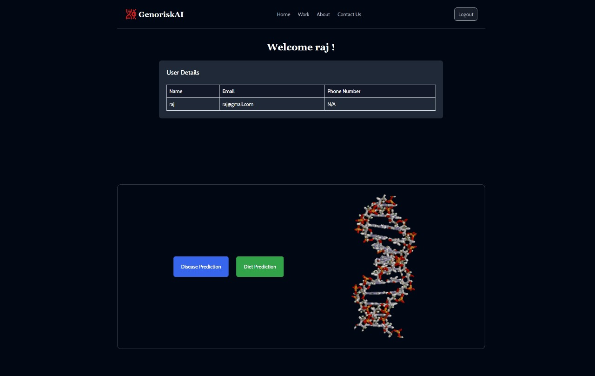

# GenoriskAI

Our project aims to develop a Genome-Based Personalized Health Risk Prediction and Diet Recommendation Platform that uses genomic data to identify health risks and provide tailored dietary advice. By combining advanced machine learning with nutritional genomics, it will promise to deliver accurate, accessible, and actionable insights. The platform stands out through its focus on user accessibility, local health integration, and stringent data privacy, revolutionizing personalized healthcare.

## Table of Contents
1. [Installation](#installation)
2. [Usage](#usage)
3. [Contributing](#contributing)

## Installation

To get started with the project, follow these steps:

1. Clone the repository:
   
   ```bash
   git clone https://github.com/Karan54820/GenoriskAI.git

2. Installing all the dependecies
   Our project is using these dependecies : [react-hot-toast axios antd mongoos express]

   ```bash
   npm install react-hot-toast axios antd mongoos express

4. Start the project : You have to run a python scrip named app.py first and then run the main project using npm command.

   1. Running app.py :
      1. Installing the dependecies for our model
         
         ```bash
         pip install requirements.txt

      2. Running our Falsk App that is our model:

         ```bash
         python app.py

   2. Running our React App
      
      ```bash
      npm run dev

## Usage

Once both the Flask and React applications are running, you can interact with the platform through the React interface. The platform will use genomic data input to predict health risks and provide personalized diet recommendations.

### Example Screenshots


*The GenoriskAI landing page showcases a genome-based health platform offering personalized disease risk predictions and diet recommendations. It encourages users to log in or register to unlock insights based on their genetic profile.*


*This dashboard page welcomes the user and displays their details, including name, email, and phone number. It offers two main options: "Disease Prediction" and "Diet Prediction," allowing the user to explore personalized insights based on their genetic data.*

## Contributing

1. Fork the repository
2. Create a new branch (git checkout -b feature-branch)
3. Commit your changes (git commit -am 'Add new feature')
4. Push to the branch (git push origin feature-branch)
5. Create a pull request
